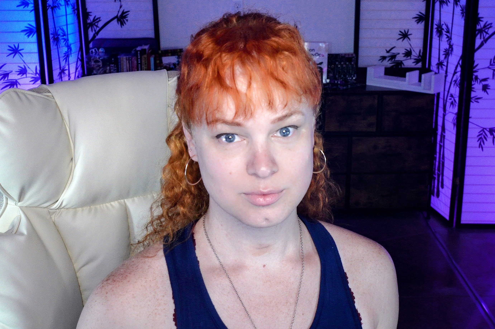

## Hello friends!

My name is Kathryn Morgan, aka Kat among friends or `@usrbinkat` on socials. Please feel encouraged to reach out if you feel so inspired. I'm always down to chat.

Welcome to my personal home on the interwebs. Mostly a parking place for tech related content as this is largely an outlet for work product that is interesting to me, but of no immediate interest to my professional employers, partners, and projects.

For readers continuing [below the fold], feel encouraged to navigate to areas of interest via the Table of Contents. This about me is littered with a smattering of oddities, topics, and tangents. Find what is interesting to you and just go with the flow <3

[below the fold]: https://www.nngroup.com/articles/page-fold-manifesto

## A few of my favorite things

### Language, Expression, & Ideas

The English language is my favorite expressive medium. I adore words, using them, and exchanging them always everywhere anytime forever. Favorite topics include tech past, present, and future. I love getting into the weeds about topics like Kubernetes, KubeVirt, Platform Engineering, DevOps, Education and edu pipelines, community development and ilk. Be warned, I will also go off on other topics like art, religion, politics, automotive centric societal evolution and the imperative need for trains (to be oddly specific).

### Navigating Life Differently

I was born in Oklahoma and raised in the 90's and 2000's by a conservative homeschool fundamentalist evangelical family. I am fortunate to have the benefit of diagnosis for my Autism spectrum neuro-divergence. "Navigating Life Differently" is a re-coined naming of the acronym "[NLD/NVLD]" diagnosis I received as a child. This impacts how I perceive, understand, and react to the world and all of the beautiful people in it. I'm proudly weird, a part time dork, and I play a cool kid on TV with some success professionally. Most importantly, with a world view shaped by an Autistic shadow disorder I feel a strong moral compass and am deeply connected to fostering an objective sense of justice (trains, again with the trains, as a matter of social justice).

[NLD/NVLD]: https://en.wikipedia.org/wiki/Nonverbal_learning_disorder

### Authenticity & Identity

Recently I feel privileged to be growing into my age. Perhaps an odd thing to say, however I have largely lived split between the qualities of being too mature for my age, and simultaneously too inexperienced at the same time. These symptoms of my life story may still exhibit evidence frequently from day to day but I've done enough in life now to appreciate the traditions I come from, the values I've learned to prioritize, and the ability to make informed decisions with reasonably good instincts to lean on.

Much of the maturity I enjoy now originates from an intersection of self realization born of experience and deeply rooted in my trans-gender life experience, success in tech sector developer advocacy and community development, conservative background, and growing pains from 10 years of marriage.

Authenticity has become a paramount and fundamental necessity in my relationships of all kinds. Caveats and imperfections acknowledged, life is incredibly short and more importantly miraculously unlikely and magnificent. I'm here to connect with people on a real level, to learn, grow, and understand perspectives that may be new or uncomfortable at first, and I hope to generally add to the empathy and joy in the world despite the chaos and drama each day brings.

### Self Actualization & Improvement

### Religion & Spirituality

belief in superior beings, no belief in divinity

In keeping with the atheist' conviction to do rather than to pray, to act rather than believe, I strongly identify with the conviction that life should be lived because it is the only chance at living which we are guaranteed.

A recent and new spiritual belief has sprung up from the study of [UOR](#universal-object-reference)

### Art & Trades

### Sport

As a transplant into the Pacific Northwest I absolutely adore the out of doors here. Whether trail running, mountain biking, lake fun, or just cruising on a long winding road trip adventure my heart belongs among the nature we so miraculously benefit from and call home on this thriving rock flying among the stars.

## Universal Object Reference

Universal Object Reference, aka UOR
