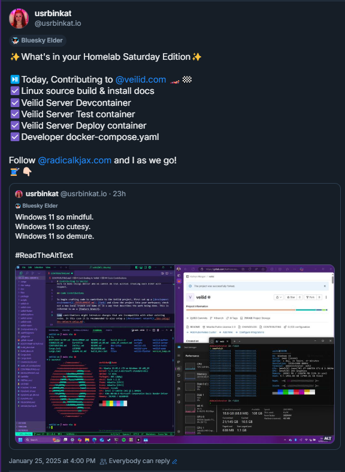

"[The only thing we have to fear is fear itself.](https://bit.ly/the-only-fear-is-fear-itself)"
<br>
— <cite>Franklin Delanor Roosevelt [^1]</cite>

Trying new things and challenging old beliefs is scary sometimes, but it’s also a great way to grow. While it’s fresh on my mind, I decided to document and share my initial setup of WSL Ubuntu, along with some creature comforts and personal preferences. Feel free to peruse each section and try out anything you like in your own system or VM.

<!--more-->

## 2025 The year of the Linux Desktop! My WSL Ubuntu on Windows 11 Explained.

It happened, I installed Windows. A simple, unremarkable thing most of the time, except I’ve barely tolerated going near Windows since leaving the Microsoft side of the house and diving into the enterprise Linux and Cloud Operations practice circa 2017. I broke from a lifelong interest in computers dominated almost exclusively by Microsoft, abandoning the Gates empire by jumping into exclusively Linux for over five years spanning dozens of distros and many generations of each.

Why branch out now? Well, frankly, I was finally convinced to try a little gaming, and even with a well-spec’d Mac and Linux box at my disposal, Microsoft has a unique kind of entrenched monopoly over the PC gaming market and now here we are.

The pleasant surprise for me was the remarkable progress in power-user features and a far more intuitive interface since my last major exposure to Windows. From the native tiling and forward-thinking [touch gestures](https://support.microsoft.com/en-us/windows/touch-gestures-for-windows-a9d28305-4818-a5df-4e2b-e5590f850741) to the maturity of [Windows Subsystem for Linux 2 (WSL2)](https://learn.microsoft.com/en-us/windows/wsl/about) for development, it’s almost like a whole new Microsoft. I was already an avid user of Microsoft Edge, [VSCodium-based IDEs](https://vscodium.com), [GitHub Codespaces](https://docs.github.com/en/codespaces/overview), and, at times, work heavily in [Microsoft Azure](https://learn.microsoft.com/en-us/azure/?product=popular).

I’m not yet sure how long I’ll continue using Windows as my daily driver, but I must say: I am impressed. Windows is back in the ring as a strong contender for earning the top spot as perhaps the best developer environment out there.

---

## Conclusion

Conclusion before ToC because life’s short so eat dessert first, y’know?

Sometimes, even the most entrenched beliefs deserve a second look. The tech landscape is a constant sea of change, and what was true five or ten years ago may not reflect the current state of affairs. Windows is absolutely worth revisiting if you’d sworn it off before. The level of innovation is impressive, and for those of us who need to get work done, having multiple strong options can be a huge advantage.

Windows has come a long way, and thanks to the efforts of the WSL team and others, it can easily go head-to-head with more traditional Linux environments for serious development. When you combine it with powerful hardware, the convenience of the Microsoft ecosystem, and an environment that feels more Linux-like than ever, you may find yourself surprisingly comfortable.

By the end of my first weekend project, I’ve achieved a comfortable, feature-complete WSL dev environment, and you can too by following along below.

Now enough of the life story first recipe blog style distraction. Find the instructions and try them yourself below. Find me on Bluesky if you like the post and share if you think I’ve lost my marbles or if this helped you in any way!

As always, build things, break things, and happy hacking to all my builder and tech explorer friends!

---

## Table of Contents

This guide is an a la carte menu of how I personally set up a new WSL Ubuntu environment—feel free to pick and choose what’s helpful for you.

1. [Introduction and Prerequisites](#1-introduction-and-prerequisites)
2. [Hostname Configuration](#2-hostname-configuration)
3. [SSH Key Generation and Git Setup](#3-ssh-key-generation-and-git-setup)
4. [Installing and Managing Repositories](#4-installing-and-managing-repositories)
5. [Installing Essential Developer Packages](#5-installing-essential-developer-packages)
6. [Installing and Configuring Rust](#6-installing-and-configuring-rust)
7. [Installing and Setting Up Neovim](#7-installing-and-setting-up-neovim)
8. [Installing Docker](#8-installing-docker)
9. [Optional Enhancements](#9-optional-enhancements)
10. [Wrap-Up](#10-wrap-up)

## What stops you from coding like this?

[See the setup in action on Bluesky!](https://bsky.app/profile/usrbinkat.io/post/3lgm4mexjj224)



---

## 1. Introduction and Prerequisites

This guide assumes you already have:

- **Windows Subsystem for Linux** installed and set up with Ubuntu.
- **WSL** up and running on your Windows machine.

If you are brand-new to WSL, refer to Microsoft’s official [WSL Documentation](https://docs.microsoft.com/windows/wsl/) for installation steps before proceeding.

---

## 2. Hostname Configuration

**Purpose**: Set a custom hostname for your WSL CLI.

1. **Set a new hostname**:
   ```bash
   sudo hostnamectl set-hostname windows
   ```
   - Replace `windows` with any hostname you prefer.
   - This will update your system’s hostname immediately and persist across sessions.
   - Open a new shell to see your new hostname in effect.

---

## 3. SSH Key Generation and Git Setup

Whether you use GitHub, GitLab, or another service, having a proper SSH key and CLI tooling can simplify your workflow.

### 3.1 Generate SSH Keys (RSA 4096)

**Purpose**: Securely authenticate to Git hosting services without typing credentials repeatedly.

1. **Generate a new RSA 4096 key**:
   ```bash
   ssh-keygen -t rsa -b 4096
   ```
   - Accept defaults or specify a file location (e.g., `~/.ssh/id_rsa`).
   - Optionally add a passphrase for enhanced security.

2. **View private and public keys** (for verification):
   ```bash
   cat ~/.ssh/id_rsa
   cat ~/.ssh/id_rsa.pub
   ```
   - Never share your **private key** (`id_rsa`).
   - You typically add your **public key** (`id_rsa.pub`) to your Git service’s SSH key settings.

3. **Add public key to GitHub/GitLab**:
   - Copy the contents of your `id_rsa.pub` file and paste into your chosen platform’s SSH key configuration.

### 3.2 Configure Git & GitHub CLI

1. **Install Git and GitHub CLI**:
   ```bash
   sudo apt update
   sudo apt install -y git gh
   ```

2. **Configure GitHub CLI with Git**:
   ```bash
   # Set up GitHub CLI to handle Git credentials
   gh auth setup-git
   ```
   This will create the necessary credential helper entries in your `.gitconfig`.

3. **Configure Git user information**:
   ```bash
   # Set your email and name for Git commits
   git config --global user.email "your.email@example.com"
   git config --global user.name "Your Name"
   ```

4. **Authenticate GitHub CLI**:
   ```bash
   # For WSL environments without a browser
   BROWSER=echo gh auth login
   ```
   - Follow the printed URL and enter the code in your browser
   - Select "HTTPS"
   - Choose "GitHub.com"
   - This will print a URL and 6 character code to login to GitHub via browser.

5. **Verify your configuration**:
   ```bash
   # View your Git configuration
   cat ~/.gitconfig
   
   # Verify GitHub CLI authentication
   gh auth status
   ```

---

## 4. Installing and Managing Repositories

**Purpose**: Enable additional Ubuntu repositories like `universe` so you have broader access to software.

1. **Add the Universe repository**:
   ```bash
   sudo add-apt-repository universe
   ```
2. **(Optional) Manually add Universe if it wasn’t enabled**:
   ```bash
   sudo add-apt-repository "deb http://archive.ubuntu.com/ubuntu $(lsb_release -sc) universe"
   ```
3. **Update the package list**:
   ```bash
   sudo apt update
   ```
4. **Upgrade installed packages** (recommended for a fresh environment):
   ```bash
   sudo apt upgrade
   ```

---

## 5. Installing Essential Developer Packages

**Purpose**: Ensure you have the fundamental tools needed for building software (C/C++ compilers, SSL libraries, etc.).

1. **Install build-essential, pkg-config, SSL dev libraries, etc.**:
   ```bash
   sudo apt install -y build-essential pkg-config libssl-dev curl git
   ```
2. **Install other helpful libraries**:
   ```bash
   sudo apt install -y autoconf automake libffi-dev zlib1g-dev cmake
   ```
   - Often required for building open-source software from source.

---

## 6. Installing and Configuring Rust

If you’re working in Rust, you’ll want to have the right version pinned.

1. **Install Rust (pin a specific version)**:
   ```bash
   curl --proto '=https' --tlsv1.2 -sSf https://sh.rustup.rs | sh -s -- --default-toolchain 1.84.0
   ```
   - This sets your default Rust toolchain to **1.84.0**.
   - Check out [Rust Releases](https://releases.rs) for more info on versioning and updates.

2. **Load Rust environment**:
   ```bash
   source $HOME/.cargo/env
   ```
   - Makes `cargo`, `rustc`, etc. immediately available.

3. **Verify Rust is installed**:
   ```bash
   cargo version
   ```
   - You should see something like `cargo 1.84.0 (9f89571 2023-08-03)`.

---

## 7. Installing and Setting Up Neovim

[Neovim](https://neovim.io/) is a modernized Vim fork, popular for its extensive plugin ecosystem.

### 7.1 Uninstall Old Vim (Optional)

If you prefer a minimal environment:
```bash
sudo apt purge nano vim vim-runtime -y
```
*(Skip if you want to keep them.)*

### 7.2 Install Neovim

```bash
sudo apt install neovim -y
```

Then, set up alternatives so commands like `vim` use Neovim:
```bash
sudo update-alternatives --install /usr/bin/editor editor /usr/bin/nvim 100
sudo update-alternatives --install /usr/bin/vi vi /usr/bin/nvim 100
sudo update-alternatives --install /usr/bin/vim vim /usr/bin/nvim 100
```

### 7.3 Python, Ruby, Node, and Perl Support

Neovim plugins often require multiple language bindings:

1. **Python and pip**:
   ```bash
   sudo apt install python3 python3-pip -y
   ```
2. **Ruby, Node.js, npm, Perl, cpanminus**:
   ```bash
   sudo apt-get install -y ruby-full nodejs npm perl cpanminus
   ```
3. **Install Neovim support packages**:
   - **Python**: `pip3 install --upgrade pynvim`
   - **Ruby**: `sudo gem install neovim`
   - **Node.js**: `sudo npm install -g neovim`
   - **Perl**: `sudo cpanm Neovim::Ext`

4. **Create a Neovim config**:
   ```bash
   mkdir -p ~/.config/nvim
   touch ~/.config/nvim/init.vim
   echo "let g:python3_host_prog = '/usr/bin/python3'" >> ~/.config/nvim/init.vim
   ```

### 7.4 Verify Neovim Health

```bash
nvim --headless -c "checkhealth" -c "qa!"
```
*(Or run `:checkhealth` from inside Neovim.)*

---

## 8. Installing Docker

If you plan to develop and run containers locally, Docker is a common choice. These steps largely follow the official [Docker Engine installation on Ubuntu](https://docs.docker.com/engine/install/ubuntu/).

1. **Remove any existing Docker (if present)**:
   ```bash
   sudo apt remove -y docker docker-engine docker.io containerd runc || true
   ```

2. **Install prerequisites**:
   ```bash
   sudo apt update
   sudo apt install -y ca-certificates curl gnupg
   ```

3. **Add Docker’s GPG key**:
   ```bash
   sudo install -m 0755 -d /etc/apt/keyrings
   curl -fsSL https://download.docker.com/linux/ubuntu/gpg | sudo gpg --dearmor -o /etc/apt/keyrings/docker.gpg
   sudo chmod a+r /etc/apt/keyrings/docker.gpg
   ```

4. **Add Docker’s repository**:
   ```bash
   echo \
    "deb [arch=\"$(dpkg --print-architecture)\" signed-by=/etc/apt/keyrings/docker.gpg] https://download.docker.com/linux/ubuntu \
    \"$(. /etc/os-release && echo \"$VERSION_CODENAME\")\" stable" \
    | sudo tee /etc/apt/sources.list.d/docker.list > /dev/null
   ```

5. **Install Docker**:
   ```bash
   sudo apt update
   sudo apt install -y docker-ce docker-ce-cli containerd.io docker-buildx-plugin docker-compose-plugin docker-compose
   ```

6. **Start Docker service**:
   ```bash
   sudo service docker start
   ```

7. **Add your user to the `docker` group** (so you don’t need `sudo docker` each time):
   ```bash
   sudo usermod -aG docker $USER
   newgrp docker
   ```
   - You may need to log out and back in for the new group membership to take effect.

---

## 9. Extra Shell Enhancements

### 9.1 Starship Prompt

A cross-shell prompt with extensive customization:
```bash
curl -sS https://starship.rs/install.sh | sh
```
Then, add to your `.bashrc`:
```bash
eval "$(starship init bash)"
```
Reload:
```bash
source ~/.bashrc
```

### 9.2 Neofetch

Show a quick system overview in your terminal:
```bash
sudo apt install neofetch
neofetch
```

### 9.3 FiraCode Font

For a slick monospaced font with ligatures:
```bash
sudo apt install fonts-firacode
```

---

## 10. Wrap-Up

And there you have it—my a la carte approach to turning Windows 11 into a surprisingly comfortable developer environment, powered by WSL2 Ubuntu, Rust, Neovim, Docker, and more. This configuration allows you to harness both the Windows ecosystem and the familiar Linux tools you know and love.

Don’t forget that the tech world is constantly changing. Tools and distributions you swore off years ago might have evolved into something truly worth revisiting. Whether it’s Windows, Linux, or any other platform, keep an open mind and stay curious—because you never know where you’ll find your next productive paradise.

Happy hacking <3

---

### References

[^1]: Quote from [Franklin Delanor Roosevelt](https://historymatters.gmu.edu/d/5057/).

### Quick Notes
- **Why Docker?**  
  Docker is especially helpful for local testing of microservices, CI/CD pipelines, or container-based workflows—common in modern DevOps practices.
- **Neovim**  
  For more details on Neovim configuration, see the official [Neovim documentation](https://neovim.io/). 
- **Links & Versions**  
  All steps above assume **Ubuntu** on **WSL2**. Always check official docs for the latest changes or differences between Ubuntu releases.
